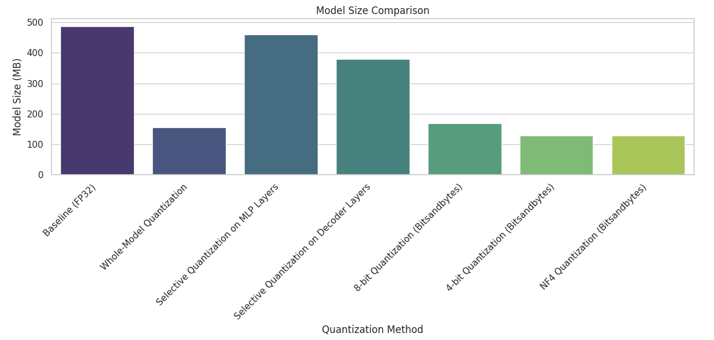
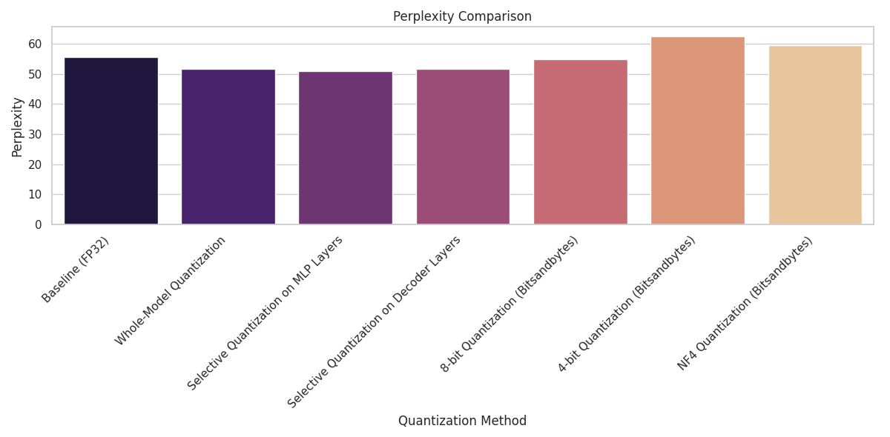
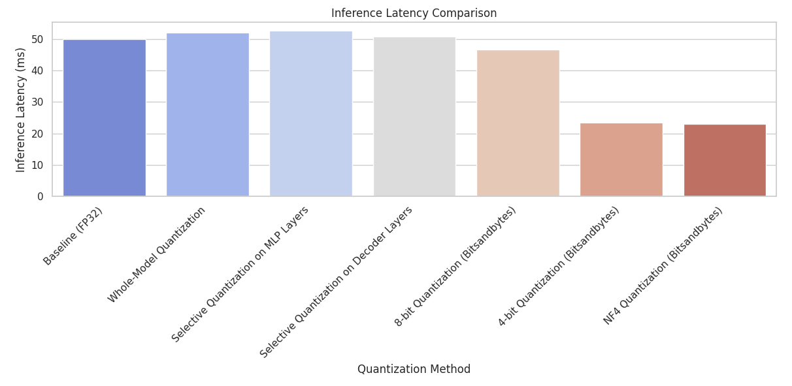

# Quantizing GPT-2 Small: A Comprehensive Guide

Demonstration of various quantization techniques applied to the GPT-2 Small model from Hugging Face. The goal is to reduce the model size and improve inference latency while maintaining acceptable performance, as measured by perplexity on the WikiText-2 dataset.

## Table of Contents

- [Introduction](#introduction)
- [Quantization Techniques](#quantization-techniques)
  - [1. Whole-Model Quantization](#1-whole-model-quantization)
  - [2. Selective Quantization on MLP Layers](#2-selective-quantization-on-mlp-layers)
  - [3. Selective Quantization on Decoder Layers](#3-selective-quantization-on-decoder-layers)
  - [4. Bitsandbytes 8-bit Quantization](#4-bitsandbytes-8-bit-quantization)
  - [5. Bitsandbytes 4-bit Quantization](#5-bitsandbytes-4-bit-quantization)
  - [6. NF4 Quantization](#6-nf4-quantization)
- [Results](#results)
  - [Metrics Summary](#metrics-summary)
  - [Graphs](#graphs)
- [Analysis](#analysis)
  - [Impact of Quantization Methods](#impact-of-quantization-methods)
  - [Understanding NF4 Quantization](#understanding-nf4-quantization)
- [Conclusion](#conclusion)

## Introduction

Quantization is a technique that reduces the precision of the numbers used to represent a model's parameters, thus reducing its memory footprint and potentially improving inference speed. This repository explores several quantization methods applied to the GPT-2 Small model:

- Whole-model quantization
- Selective quantization on MLP layers
- Selective quantization on decoder layers
- Bitsandbytes 8-bit quantization
- Bitsandbytes 4-bit quantization
- NF4 quantization

## Quantization Techniques


### 1. Whole-Model Quantization

**Overview:**

Whole-model quantization involves converting all the model's weights from higher precision (e.g., 32-bit floating-point) to a lower precision format (e.g., 8-bit integers). This significantly reduces the model size and can improve inference speed. However, it may affect model performance due to the loss of precision.

**Implementation Details:**

- **Quantization Function:**

  ```python
  def quantize_model_weights(model):
      quantized_state_dict = {}
      scales = {}
      zero_points = {}
      for name, param in model.state_dict().items():
          if param.dtype in [torch.float32, torch.float16]:
              # Compute the minimum and maximum values of the parameter tensor
              min_val = param.min()
              max_val = param.max()
              qmin = -128
              qmax = 127
              # Compute scale and zero-point for quantization
              scale = (max_val - min_val) / (qmax - qmin)
              if scale == 0:
                  scale = 1e-8  # Prevent division by zero
              zero_point = qmin - min_val / scale
              zero_point = int(zero_point.round())
              # Quantize the parameter tensor
              q_param = ((param / scale) + zero_point).round().clamp(qmin, qmax).to(torch.int8)
              # Store quantized parameter and quantization parameters
              quantized_state_dict[name] = q_param
              scales[name] = scale
              zero_points[name] = zero_point
          else:
              # Keep parameters that are not float32 or float16 in their original form
              quantized_state_dict[name] = param
      return quantized_state_dict, scales, zero_points
  ```

- **Explanation of Variables:**

  - **`model`:** The neural network model to be quantized.
  - **`quantized_state_dict`:** A dictionary to store the quantized parameters.
  - **`scales`:** A dictionary to store the scale factors for each parameter tensor.
  - **`zero_points`:** A dictionary to store the zero-points for each parameter tensor.
  - **`name`:** The name of the parameter tensor in the model's `state_dict`.
  - **`param`:** The parameter tensor corresponding to `name`.
  - **`min_val` and `max_val`:** The minimum and maximum values in the parameter tensor, used to compute the scale.
  - **`qmin` and `qmax`:** The minimum and maximum values representable in int8 (-128 to 127).
  - **`scale`:** The scaling factor used to map floating-point values to integers.
  - **`zero_point`:** The zero-point used in quantization to adjust the mapping.
  - **`q_param`:** The quantized parameter tensor.

- **How It Works:**

  1. **Iterate Over Parameters:**
     - The function loops through each parameter (`param`) in the model's state dictionary (`state_dict`).
  2. **Check Data Type:**
     - If the parameter is of type `torch.float32` or `torch.float16`, it is eligible for quantization.
  3. **Compute Scale and Zero-Point:**
     - **Scale (`scale`):** Determines the mapping from floating-point values to quantized values.
     - **Zero-Point (`zero_point`):** Adjusts the mapping to ensure zero in floating-point maps to zero in quantized space.
     - **Avoid Division by Zero:** If the scale is zero (which can happen if `min_val` equals `max_val`), it is set to a small value (`1e-8`).
  4. **Store Quantized Data:**
     - The quantized parameter, along with its scale and zero-point, is stored in the respective dictionaries.
  5. **Handle Non-Float Parameters:**
     - Parameters not in `torch.float32` or `torch.float16` (e.g., embeddings) are left unchanged.

- **Dequantization Function:**

  ```python
  def dequantize_model_weights(quantized_state_dict, scales, zero_points):
      state_dict = {}
      for name, param in quantized_state_dict.items():
          if param.dtype == torch.int8:
              # Retrieve scale and zero-point for this parameter
              scale = scales[name]
              zero_point = zero_points[name]
              # Dequantize the parameter tensor back to floating-point
              dequantized_param = (param.to(torch.float32) - zero_point) * scale
              state_dict[name] = dequantized_param
          else:
              # Keep parameters that were not quantized in their original form
              state_dict[name] = param
      return state_dict
  ```

- **Explanation of Variables:**

  - **`quantized_state_dict`:** The dictionary containing quantized parameters.
  - **`state_dict`:** A dictionary to store the dequantized parameters.
  - **`param`:** The quantized parameter tensor.
  - **`dequantized_param`:** The dequantized parameter tensor in floating-point format.

- **How It Works:**

  1. **Iterate Over Quantized Parameters:**
     - The function loops through each quantized parameter in `quantized_state_dict`.
  2. **Check Data Type:**
     - If the parameter is of type `torch.int8`, it is dequantized.
  3. **Retrieve Scale and Zero-Point:**
     - The scale and zero-point used during quantization are retrieved.
  4. **Store Dequantized Data:**
     - The dequantized parameter is stored back into the state dictionary.
  5. **Handle Non-Quantized Parameters:**
     - Parameters that were not quantized are left unchanged.

### 2. Selective Quantization on MLP Layers

**Overview:**

Selective quantization targets specific components of the model—in this case, the MLP (feed-forward) layers within each transformer block. By focusing on these layers, we aim to reduce the model size while minimizing the impact on performance.

**Implementation Details:**

- **Quantization Function:**

  ```python
  def quantize_selective_mlp(model):
      quantized_state_dict = {}
      scales = {}
      zero_points = {}
      for name, param in model.state_dict().items():
          if 'mlp' in name and param.dtype in [torch.float32, torch.float16]:
              # Quantize the MLP layer parameters
              # (same quantization process as in whole-model quantization)
              # ...
          else:
              # Keep other parameters unchanged
              quantized_state_dict[name] = param
      return quantized_state_dict, scales, zero_points
  ```

- **Explanation of Variables:**

  - **`'mlp' in name`:** Checks if the parameter belongs to an MLP layer by looking for `'mlp'` in its name.
  - **`param`:** The parameter tensor to be potentially quantized.
  - **Other variables:** Similar to those in the whole-model quantization function.

- **How It Works:**

  1. **Iterate Over Parameters:**
     - The function loops through each parameter in the model's `state_dict`.
  2. **Identify MLP Layers:**
     - Parameters whose names contain `'mlp'` are considered part of the MLP layers.
  3. **Check Data Type and Quantize:**
     - If the parameter is of type `torch.float32` or `torch.float16`, it is quantized using the same method as in whole-model quantization.
  4. **Store Quantized and Unchanged Parameters:**
     - Quantized MLP parameters are stored in `quantized_state_dict`.
     - Non-MLP parameters or those not eligible for quantization are stored unchanged.

### 3. Selective Quantization on Decoder Layers

**Overview:**

This method applies quantization to specific decoder layers. By selectively quantizing certain layers, we aim to reduce the model size while preserving the performance of critical components.

**Implementation Details:**

- **Quantization Function:**

  ```python
  def quantize_selective_decoder(model, layers_to_quantize):
      quantized_state_dict = {}
      scales = {}
      zero_points = {}
      for name, param in model.state_dict().items():
          quantize_param = False
          for layer_idx in layers_to_quantize:
              layer_name = f'transformer.h.{layer_idx}.'
              if name.startswith(layer_name):
                  quantize_param = True
                  break
          if quantize_param and param.dtype in [torch.float32, torch.float16]:
              # Quantize the parameters of the selected decoder layers
              # (same quantization process as in whole-model quantization)
              # ...
          else:
              # Keep other parameters unchanged
              quantized_state_dict[name] = param
      return quantized_state_dict, scales, zero_points
  ```

- **Explanation of Variables:**

  - **`layers_to_quantize`:** A list of decoder layer indices to be quantized.
  - **`quantize_param`:** A boolean flag indicating whether the current parameter should be quantized.
  - **`layer_idx`:** An index of a decoder layer.
  - **`layer_name`:** The prefix of parameter names belonging to a specific decoder layer (e.g., `'transformer.h.0.'`).
  - **Other variables:** Similar to those in the whole-model quantization function.

- **How It Works:**

  1. **Iterate Over Parameters:**
     - The function loops through each parameter in the model's `state_dict`.
  2. **Identify Decoder Layers to Quantize:**
     - For each parameter, it checks if its name starts with the layer prefix of any layer in `layers_to_quantize`.
  3. **Set Quantization Flag:**
     - If the parameter belongs to one of the specified layers, `quantize_param` is set to `True`.
  4. **Check Data Type and Quantize:**
     - If `quantize_param` is `True` and the parameter is of type `torch.float32` or `torch.float16`, it is quantized.
  5. **Store Quantized and Unchanged Parameters:**
     - Quantized parameters are stored in `quantized_state_dict`.
     - Other parameters are stored unchanged.

### 4. Bitsandbytes 8-bit Quantization

**Overview:**

Bitsandbytes is a library that provides efficient 8-bit and 4-bit quantization techniques with custom CUDA kernels, enabling faster computations on GPUs. The 8-bit quantization method reduces the model size significantly while maintaining similar performance to the full-precision model.

**Implementation Details:**

- **Quantization Configuration:**

  ```python
  bnb_config_8bit = BitsAndBytesConfig(load_in_8bit=True)
  ```

- **Model Loading with Quantization:**

  ```python
  model_8bit = AutoModelForCausalLM.from_pretrained(
      model_name,
      quantization_config=bnb_config_8bit,
      device_map='auto'
  )
  ```

- **Explanation of Variables:**

  - **`bnb_config_8bit`:** An instance of `BitsAndBytesConfig` configured for 8-bit quantization.
    - **`load_in_8bit=True`:** Indicates that the model should be loaded in 8-bit precision.
  - **`model_name`:** The name or path of the pre-trained model (e.g., `'gpt2'`).
  - **`model_8bit`:** The model loaded with 8-bit quantization applied.
  - **`quantization_config`:** The configuration passed to the model loader to apply quantization.
  - **`device_map='auto'`:** Automatically maps the model to available devices (e.g., GPU).

- **How It Works:**

  1. **Configure Quantization:**
     - The `BitsAndBytesConfig` object specifies that the model should be loaded in 8-bit precision.
  2. **Load Quantized Model:**
     - The `from_pretrained` method loads the pre-trained model and applies the quantization configuration.
  3. **Bitsandbytes Integration:**
     - Bitsandbytes modifies the underlying layers to perform computations using 8-bit integers.
  4. **Efficiency:**
     - Custom CUDA kernels optimize the performance, allowing for efficient inference with reduced memory usage.

### 5. Bitsandbytes 4-bit Quantization

**Overview:**

This method uses Bitsandbytes to quantize the model weights to 4 bits using linear quantization (FP4). While this reduces the model size further than 8-bit quantization, it may lead to more significant performance degradation due to the lower precision.

**Implementation Details:**

- **Quantization Configuration:**

  ```python
  bnb_config_4bit = BitsAndBytesConfig(
      load_in_4bit=True,
      bnb_4bit_compute_dtype=torch.float16,
      bnb_4bit_use_double_quant=True,
      bnb_4bit_quant_type='fp4'  # Linear quantization
  )
  ```

- **Model Loading with Quantization:**

  ```python
  model_4bit = AutoModelForCausalLM.from_pretrained(
      model_name,
      quantization_config=bnb_config_4bit,
      device_map='auto'
  )
  ```

- **Explanation of Variables:**

  - **`bnb_config_4bit`:** Configuration for 4-bit linear quantization.
    - **`load_in_4bit=True`:** Indicates 4-bit precision loading.
    - **`bnb_4bit_compute_dtype=torch.float16`:** Sets the computation data type to `float16` for intermediate calculations.
    - **`bnb_4bit_use_double_quant=True`:** Enables double quantization to improve accuracy.
    - **`bnb_4bit_quant_type='fp4'`:** Specifies linear 4-bit quantization.
  - **`model_4bit`:** The model loaded with 4-bit quantization applied.

- **How It Works:**

  1. **Configure Quantization:**
     - The configuration sets up the model to use 4-bit linear quantization.
  2. **Load Quantized Model:**
     - The model is loaded with the specified quantization settings.
  3. **Double Quantization:**
     - Double quantization helps mitigate some precision loss by applying an additional quantization step.
  4. **Efficiency:**
     - Computations are performed using `float16` to balance precision and speed.

### 6. NF4 Quantization

**Overview:**

NF4 (Normal Float 4) quantization is a non-linear 4-bit quantization method provided by Bitsandbytes. It aims to preserve more information compared to linear quantization by mapping weights to a normal distribution before quantization. This can result in better performance compared to linear 4-bit quantization.

**Implementation Details:**

- **Quantization Configuration:**

  ```python
  bnb_config_nf4 = BitsAndBytesConfig(
      load_in_4bit=True,
      bnb_4bit_compute_dtype=torch.float16,
      bnb_4bit_use_double_quant=True,
      bnb_4bit_quant_type='nf4'  # Non-linear quantization
  )
  ```

- **Model Loading with Quantization:**

  ```python
  model_nf4 = AutoModelForCausalLM.from_pretrained(
      model_name,
      quantization_config=bnb_config_nf4,
      device_map='auto'
  )
  ```

- **Explanation of Variables:**

  - **`bnb_config_nf4`:** Configuration for NF4 quantization.
    - **`bnb_4bit_quant_type='nf4'`:** Specifies NF4 (non-linear) 4-bit quantization.
  - **Other variables:** Similar to those in the 4-bit linear quantization setup.

- **How It Works:**

  1. **Configure Quantization:**
     - The configuration sets up the model to use NF4 quantization.
  2. **Load Quantized Model:**
     - The model is loaded with NF4 quantization applied.
  3. **Non-Linear Quantization:**
     - NF4 quantization maps weights to a normal distribution before quantization, allocating more bits to values near the mean.
  4. **Performance Preservation:**
     - By focusing on frequently occurring values, NF4 aims to retain more critical information, leading to better performance compared to linear 4-bit quantization.

---

## Results

### Metrics Summary

The following table summarizes the performance metrics for each quantization method:

| **Quantization Method**              | **Model Size (MB)** | **Perplexity** | **Inference Latency (ms)** |
|--------------------------------------|---------------------|----------------|----------------------------|
| Baseline (FP32)                      | 486.70              | 55.55          | 49.96                      |
| **Whole-Model Quantization**         | 155.48              | 51.67          | 52.10                      |
| **Selective Quantization on MLP**    | 459.81              | 50.80          | 52.65                      |
| **Selective Quantization on Decoder**| 378.59              | 51.69          | 50.80                      |
| **8-bit Quantization (Bitsandbytes)**| 168.35              | 54.75          | 46.60                      |
| **4-bit Quantization (Bitsandbytes)**| 127.85              | 62.42          | 23.35                      |
| **NF4 Quantization (Bitsandbytes)**  | 127.85              | 59.51          | 22.95                      |

### Graphs

#### 1. Model Size Comparison



#### 2. Perplexity Comparison



#### 3. Inference Latency Comparison



## Analysis

### Impact of Quantization Methods

**Whole-Model Quantization:**

- **Model Size Reduction:** Reduced the model size by approximately 68%.
- **Performance:** Improved perplexity, indicating that quantization acted as a form of regularization.
- **Inference Latency:** Slightly increased due to the overhead of dequantization during inference.

**Selective Quantization on MLP Layers:**

- **Model Size Reduction:** Minimal reduction (~5.5%), as MLP layers constitute a smaller portion of the model.
- **Performance:** Improved perplexity, suggesting that quantizing MLP layers helps regularize the model.
- **Inference Latency:** Slight increase due to mixed-precision computations.

**Selective Quantization on Decoder Layers:**

- **Model Size Reduction:** Moderate reduction (~22.2%).
- **Performance:** Improved perplexity, balancing size reduction and performance.
- **Inference Latency:** Slightly better than the baseline, possibly due to reduced computational load in decoder layers.

**Bitsandbytes 8-bit Quantization:**

- **Model Size Reduction:** Significant reduction (~65.4%).
- **Performance:** Slight decrease in perplexity, maintaining close performance to the baseline.
- **Inference Latency:** Decreased, benefiting from optimized CUDA kernels in bitsandbytes.

**Bitsandbytes 4-bit Quantization:**

- **Model Size Reduction:** Largest reduction (~73.7%).
- **Performance:** Noticeable increase in perplexity, indicating performance degradation.
- **Inference Latency:** Significantly decreased due to lower computational requirements.

**NF4 Quantization:**

- **Model Size Reduction:** Same as 4-bit quantization (~73.7%).
- **Performance:** Better perplexity than linear 4-bit quantization, but still higher than the baseline.
- **Inference Latency:** Slightly better than 4-bit quantization.

### Understanding NF4 Quantization

**Concept:**

- **Non-Linear Quantization:** NF4 quantization maps weights to a normal distribution before quantization, as opposed to linear quantization, which uniformly quantizes the weight range.
- **Information Preservation:** By focusing on the distribution of weights, NF4 aims to retain more critical information, especially for weights near zero, which are often more significant in neural networks.

**Differences from Linear Quantization:**

- **Linear Quantization:**

  - Uniformly divides the range of weights into equal intervals.
  - May not effectively capture the distribution of weights, leading to higher quantization errors, especially for values clustered around zero.

- **NF4 Quantization:**

  - Uses a non-linear scaling that allocates more quantization levels to values near the mean of the distribution.
  - Reduces quantization errors for frequently occurring weight values, improving overall model performance compared to linear 4-bit quantization.

**Impact on Model Accuracy and Efficiency:**

- **Accuracy:**

  - NF4 quantization generally results in better model accuracy (lower perplexity) compared to linear 4-bit quantization.
  - The non-linear scaling preserves more information where it matters most.

- **Efficiency:**

  - Both NF4 and linear 4-bit quantization offer similar reductions in model size and computational requirements.
  - NF4 provides a better trade-off between size reduction and performance degradation.

## Conclusion

- **Model Size vs. Performance Trade-off:**

  - **Whole-Model Quantization** provides substantial model size reduction with improved perplexity but slightly increased inference latency.
  - **Selective Quantization** offers minimal size reduction and may not significantly benefit latency.
  - **Bitsandbytes 8-bit Quantization** is effective in reducing model size with minimal impact on performance and latency.
  - **Bitsandbytes 4-bit and NF4 Quantization** significantly reduce model size and improve latency but at the cost of increased perplexity.
  - **NF4 Quantization** offers a better balance than linear 4-bit quantization, achieving lower perplexity while maintaining the same efficiency.

- **Best Results:**

  - Use **8-bit Quantization** when you need to reduce model size without significantly affecting performance.
  - Consider **NF4 Quantization** for applications where inference speed is critical and some performance degradation is acceptable.
  - **Selective Quantization** may be suitable when targeting specific model components for size reduction, but benefits may be limited.

  ---