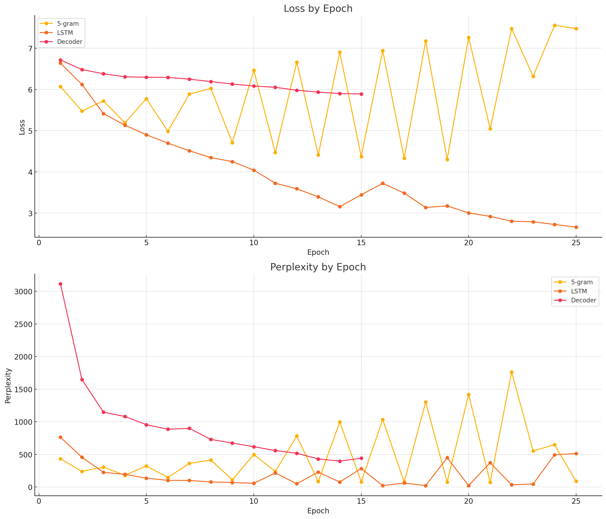

# Test Perplexity Scores Comparison:

- **5-gram Model**: 305.28
- **LSTM Model**: 198.35
- **Decoder Model**: 194.3

### Analysis:

- **Decoder Model (194.3)**: This model has the **lowest perplexity** among the three, suggesting it handles the test data better than the LSTM and 5-gram models. The decoder architecture, which often captures context better through mechanisms like self-attention, could explain its superior performance on shorter sentences (less than 20 words).

- **LSTM Model (198.35)**: Slightly higher perplexity than the decoder but still significantly better than the 5-gram model. LSTMs are known for their ability to model sequential dependencies, which explains its relatively low perplexity.

- **5-gram Model (305.28)**: This has the highest perplexity, which indicates that it struggles more with predicting the next word in the sequence, likely due to its limited ability to capture long-range dependencies compared to the neural network-based models.

### Conclusion:
- **Best Model**: The **Decoder Model** is the best-performing model in terms of test perplexity, closely followed by the LSTM. The 5-gram model falls behind, showing that deep learning models like LSTM and Decoder perform better on language modeling tasks, especially for handling short sentences.

---

# Analysis during Traning:

1. **Loss by Epoch**:
   - **5-gram Model**: The loss fluctuates significantly, showing instability and suggesting that the model struggles to converge.
   - **LSTM Model**: Displays a smooth and steady decline in loss over time, indicating stable learning and improvement across epochs.
   - **Decoder Model**: The decoder shows a slower decline in loss but maintains a steady downward trend. With more epochs, it could potentially surpass the LSTM model in performance.

2. **Perplexity by Epoch**:
   - **5-gram Model**: Has high fluctuations in perplexity, showing that it struggles with making accurate predictions consistently.
   - **LSTM Model**: Shows a rapid decrease in perplexity, stabilizing at lower values as the training progresses, suggesting strong performance.
   - **Decoder Model**: Starts with much higher perplexity but decreases steadily, showing promising improvements and competitive performance after more epochs.

### Conclusion:
The **LSTM model** shows the best overall performance in terms of both loss and perplexity stability. However, the **Decoder model** also demonstrates significant improvement and could potentially outperform the LSTM with more training. The **5-gram model** struggles the most due to its inability to capture complex dependencies.